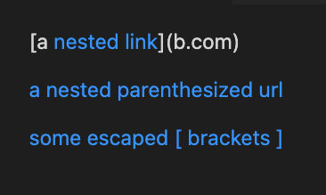
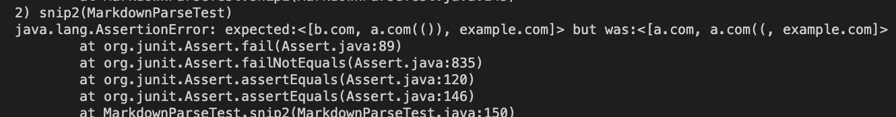

***Lab Report 4***
--
---

Pedro Castaneda

May 22, 2022

---
**Snippet 1**

---

**Snippet 2**

---

**Snippet 3**

---

My Markdown Parse: [Link](https://github.com/Pgerardocastaneda/markdown-parser)

Shared Markdown Parse: [Link](https://github.com/FishInAZ/makrdown-parse-own)

---

**Creating the tests in MarkdownParseTest.java:**

---
**Snippet 1: Both Failed**

Mine:

Theirs:

---
**Snippet 2: Both Failed**

Mine:

Theirs:

---
**Snippet 3: Both Failed**

Mine:

Theirs:

---
**Questions**

1. I believe there is a small code change to fix snippet 1. The code that would need to be implmented would have to look for " ' " or for symbols like [] within link sbecause they are not taken into a count when the code is ran. 

2. No I do not think there is a small code change to fix snippet 2. To fix snippet 2 it would require longer lines where you would use loops to ensure that all instances of () or [] are not skipped and are valid. 

3. No I do not think there is a small code change to fix snippet 3. To fix snippet three you would need lines of code that can handle long input and, same as snippet 2, would need loops to ensure () and [] are not overlooked and are validated when ran. 

