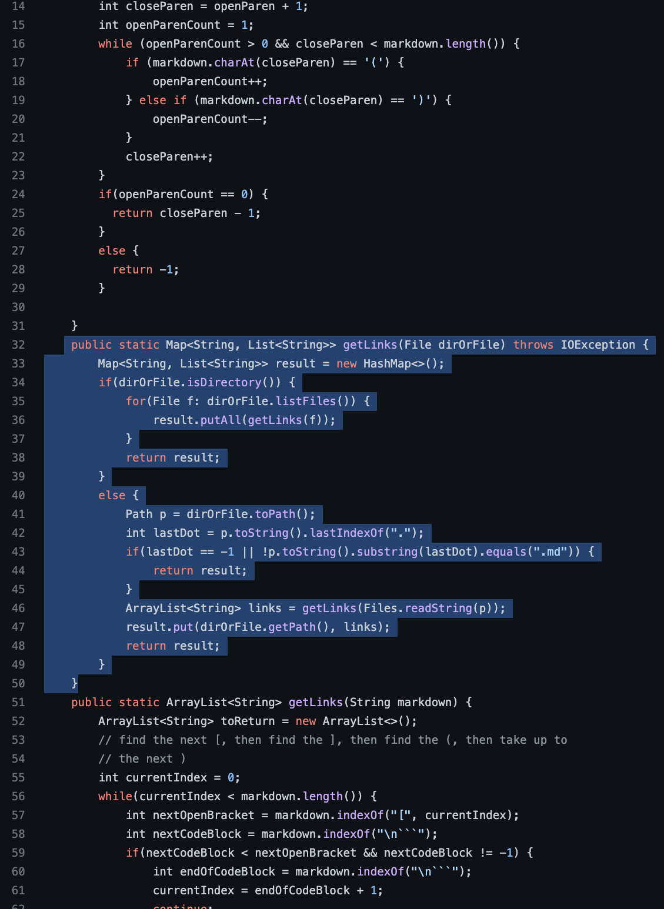

***Lab Report 5***
--

Pedro Castaneda

June 5, 2022

---

**Finding the Tests**

To find the tests with different results I used:

- ***vimdiff markdown-parse/results.txt cse15lsp22-markdown-parser/results.txt***

After running these commands in the command line it began to list all of the tests in the terminal and were color coded. Everything in blue meant they had the same result, anything highlighted in pink had differnt results in the secured server and the client.

Two tests that were ran and output different results:

[Test 519.md](https://github.com/nidhidhamnani/markdown-parser/blob/main/test-files/519.md)

[Test 489.md](https://github.com/nidhidhamnani/markdown-parser/blob/main/test-files/489.md)

---

***Example Test 1***
--

The left hand side of the image is the result from my markdown-parser and the right hand side is the result front the provuded markdown-parser.

Both outputs in this case are incorrect. The expected output is:

The error is that the code is not meant to take in images and rather than skipping over it, the code treated it as a link. To correct this error there would need to be a check statment to make sure that the test file is a link and not an image in the following segment:

---

***Example Test 2***
--

The left hand side of the image is the result from my markdown-parser and the right hand side is the result front the provuded markdown-parser.

Both outputs in this case are incorrect. The expected output is:

The error is that the code does not check for a new line and for this it anticipates that there is no link. To correct this error there would need to be a check for a new line and the fix would be in the following segment:

