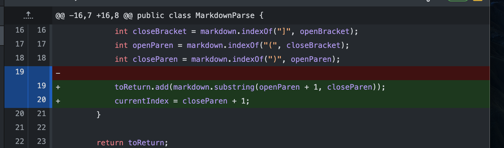
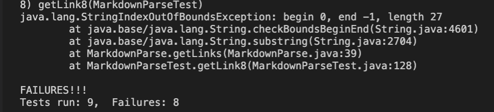
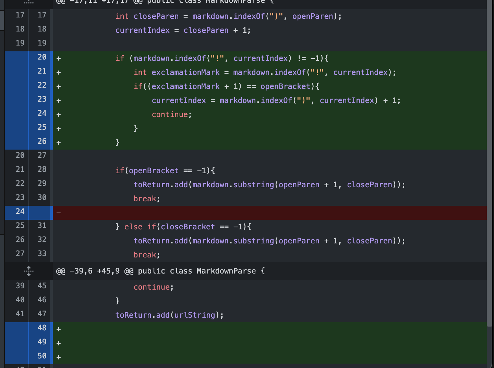
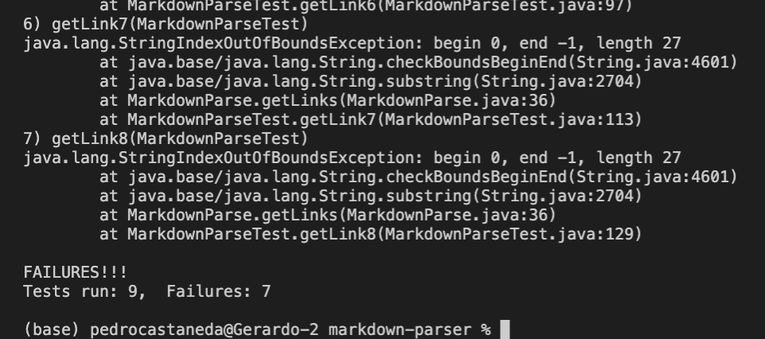
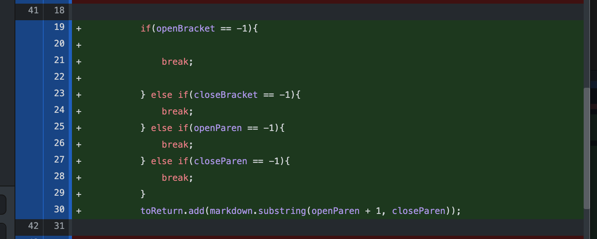
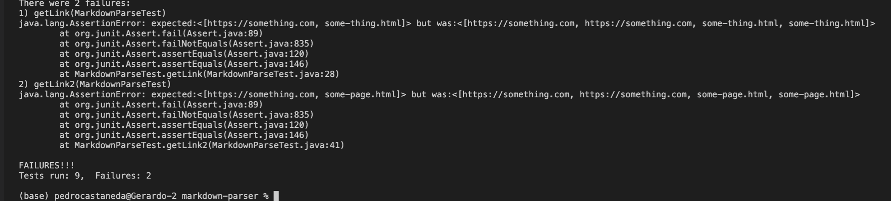

#Lab Report 2

Pedro Castaneda

May 1, 2022

---
***Code Change One***

[Failed Test File](test-file.md)

*Symptom*

There was an index out of bounds error occurring the was causing an infinte loop. This was due to the fact that there was not a way to stop the code from continuing. This was an issue shared among all of the test files, hence nothing could be printed into the terminal.  

---

***Code Change Two***

[Failed Test File](test-file3.md)

*Symptom*

In attempt to add more specifications such as there being extra characters in the file and having certain characters in the wrong place, still experienced an index error and only the orginal test passed. This was due to the fact that the addtions were only checking for the best case scenarios and not edge cases where it can break.

---

***Code Change Three***

[Failed Test File](test-file2.md)

*Symptom*

Again I was having the same issue in reguards to indexing. I was able to improve my code and fix this issue with the rest of the test files. I  managed this by improving the break statements so that we no longer came across the index error. Upon further investigation the final file that was failing was due to a testing error were I was expecting the wrong output. 

---
