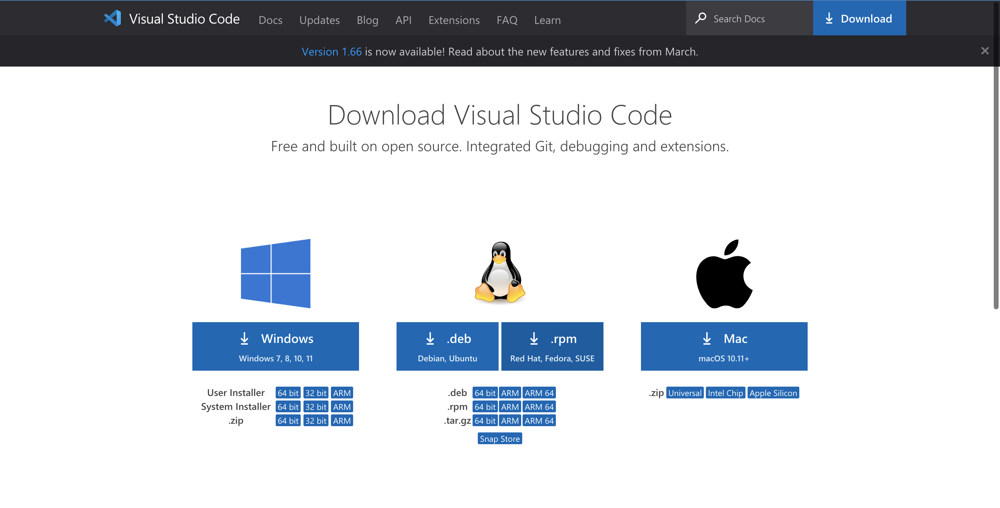
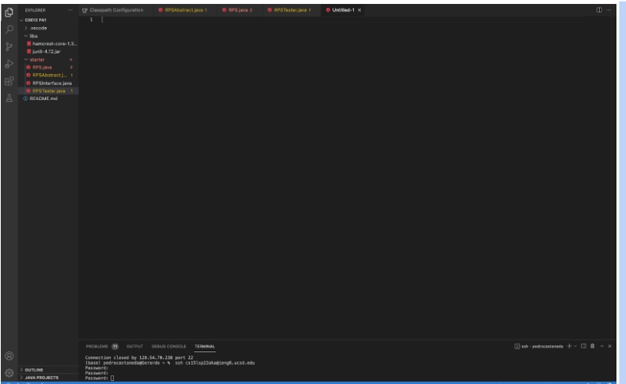
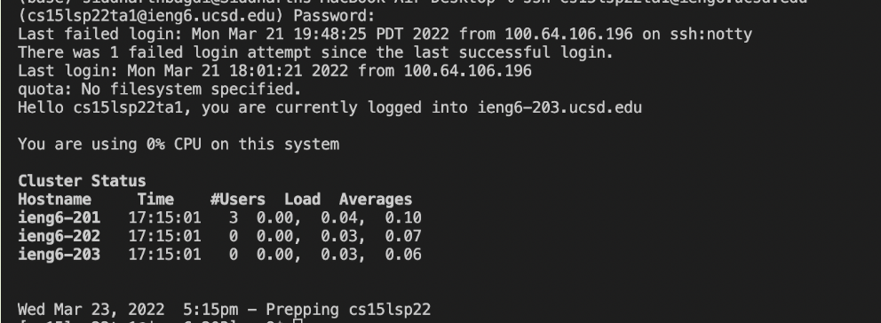
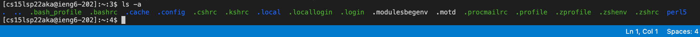
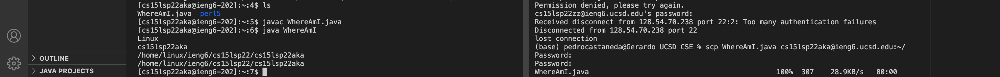
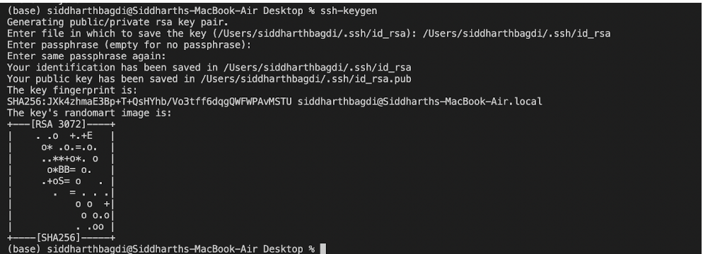
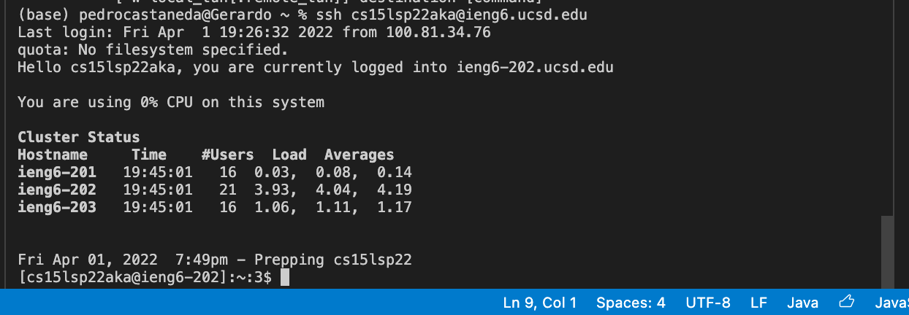

#CSE 15L Lab Report
---

In first week of the CSE 15L we learned how to remotelly connect to a server, tested a few commands after connecting, moved files using scp, set up an SSH key, and optimize mote running. Below will be a detailed explantion to the steps I took for each of these parts with visual examples. 

---
***Part 1***

To start off I needed to download Visual Studio Code in order to use its terminal to complete the first lab. 

[Link to download VS Code](https://code.visualstudio.com/download)

I myself downloaded Visual Studio Code for Mac and followed the steps displayed by the website until my step up looked like the following:

---

***Part 2***

The next step in the lab was to connect to a server remotely. To do this we type the command: ssh cs15lsp22zz@ieng6.ucsd.edu. Each peer in the class has a unique account to log into and with a unique password needed to access them. To differentiate between them we all use the above account but we replace the zz before the @ symbol with the letters unique to our account. Because it is the first time connect we need to say yes to the question prompted after the intial line in the terminal is ran. If down coorrectly you will see:

---

***Part 3***

Now that we were connected to the server we tried out some commands to see how they would interact or see what they would output from the server. A few of the commands we attempted were:

* cd ~
* cd
* ls -lat
* ls -a
* ls <directory> where <directory> is /home/linux/ieng6/cs15lsp22/cs15lsp22abc, where the abc is one of the other group members’ username
* cp /home/linux/ieng6/cs15lsp22/public/hello.txt ~/
* cat /home/linux/ieng6/cs15lsp22/public/hello.txt

Each member from my group tested different commands, the one I attempted was ls-a.

---

***Part 4***

Next we tried moving files with scp. I created a test file called WhereAmI.java and moved it from my Mac computer to the server files. To do this I typed in the terminal: 

scp WhereAmI.java cs15lsp22zz@ieng6.ucsd.edu:~/

When you type this command you will be asked to put in you account password again to confirm the action of the command. Once the file is moved you can successfully run the file from the server using javac and java. The interaction looked like this.

(The left side is ther server and the right is the client)

---

***Part 5***

Now that we can move files and access a server, we want to make the process a lot faster to save time. One of the steps that is extremly time consuming is having to log back in repeatedly in bwteen interactions. To reduce this time consumption we can generate a ssh key to remove the login step comepletely. To do this in the terminal we type:

* ssh-keygen
* Generating public/private rsa key pair.
* Enter file in which to save the key (/Users/<user-name>/.ssh/id_rsa): /Users/<user-name>/.ssh/id_rsa
* Enter passphrase (empty for no passphrase):

The interactin will look like this:

Be sure to not add a passphrase and leave it blank. Now whenerver you want to log in to your account the interaction is a lot quicker and will look more like the following:

 With that you are now able to successfully access and efficiently work on a server from your client device. 
