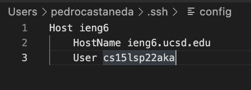
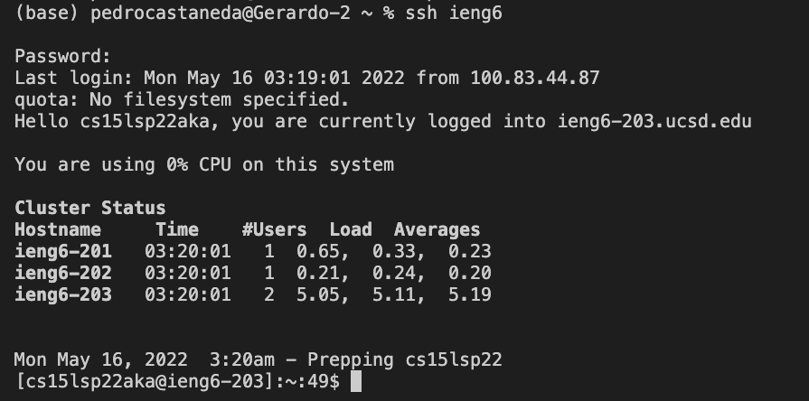
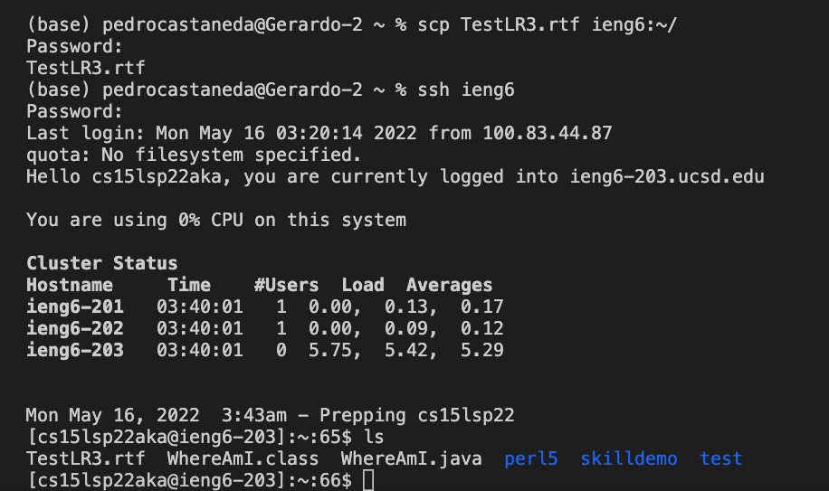
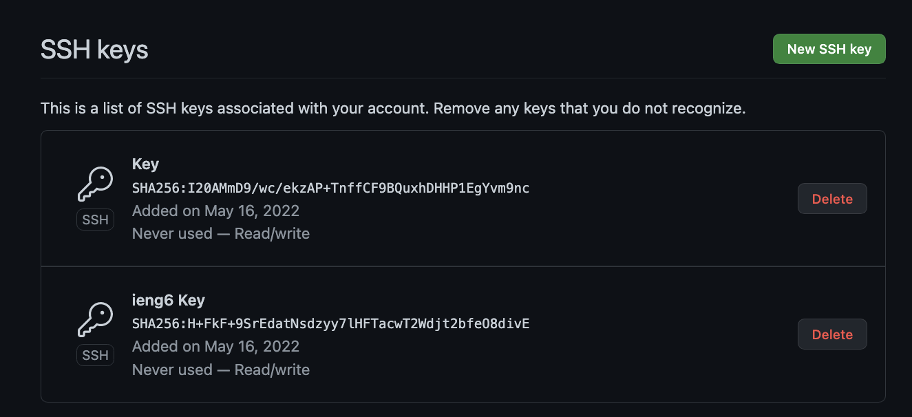
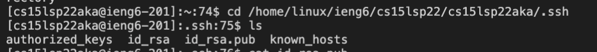
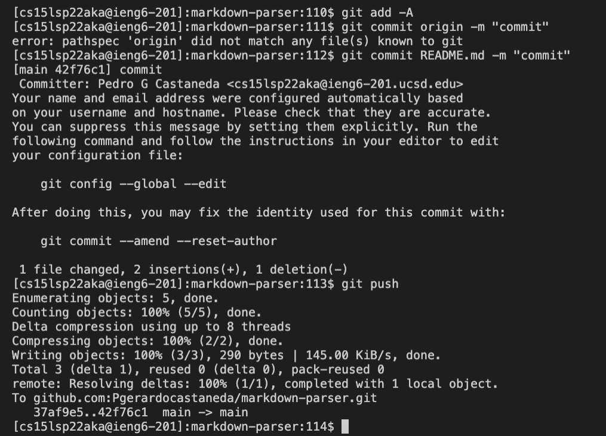
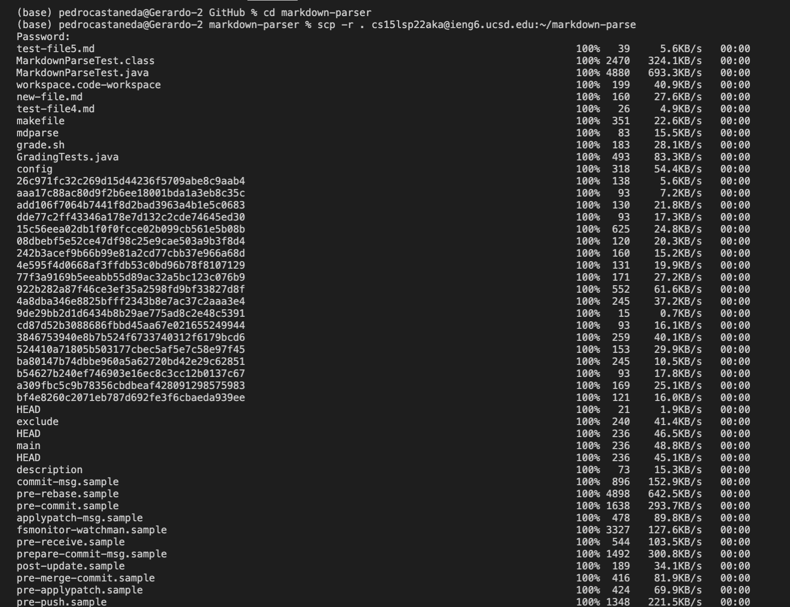
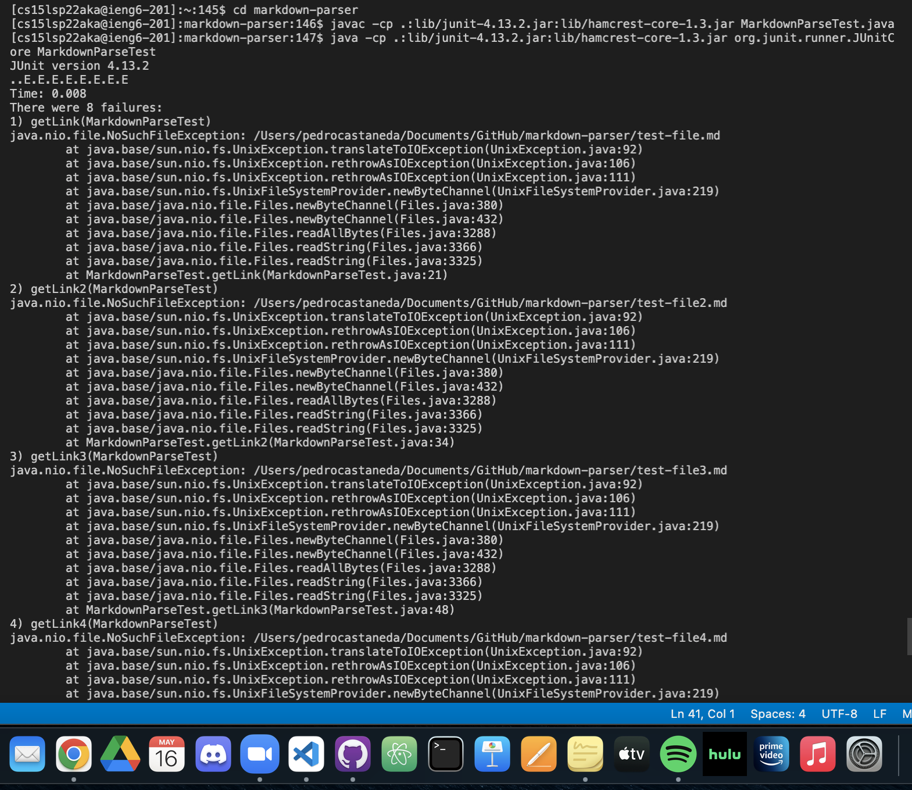
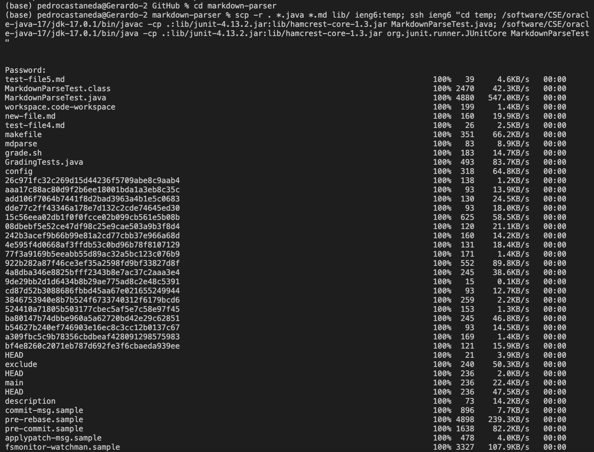

***Lab Report 3***
---
---

May 8, 2022

**Part 1: Streamlining ssh Configuration**

Contents of .ssh/config file:

The config file contains the host name and is called onto when logining in for faster login time. Now when I need to log onto a secure server I can use the comman ssh ieng6 and skip typing out the entire account name.

From my client I copied a file named TestLR3.rtf to my account using: *scp TestLR3.rtf ieng6:~/* and then logged back into my account to check if it successfully copied over which it did.

---

**Part 2: Setup Github Access from ieng6**

Where the Public and private key are stored in Github.

Where the private key is store in ssh

Running git hub commands to commit and push a change to github while logged into ssh.

[Resulting Commit](https://github.com/Pgerardocastaneda/markdown-parser/commit/42f76c1b42341e1c7c362d7db0ba8cd6585b0910)

---

**Part 3: Copy whole directories with scp -r**

Copying entire markdown-parse directory to my ieng6 account.

Logging into my ieng6 account and compiling and running the tests for my repository.

Combining scp and ssh to copy the whole directory and run the tests in one line.

---
